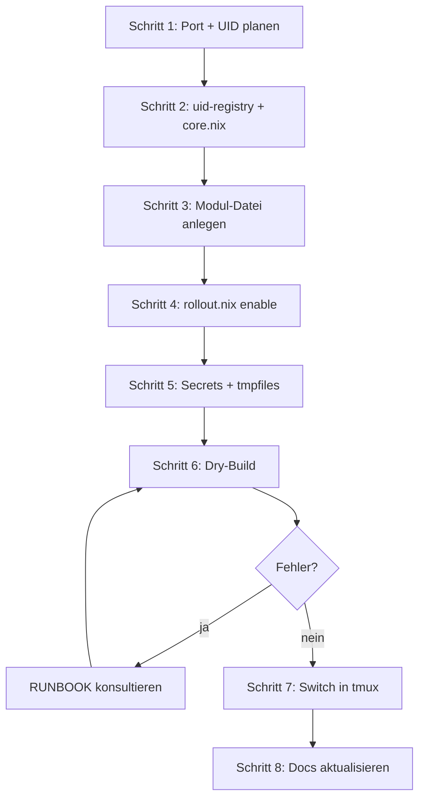
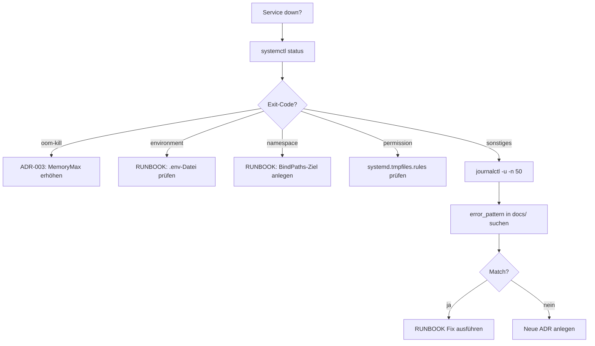

---
meta:
  role: checklist
  purpose: Wiederholbare Workflows als Schritt-für-Schritt-Checklisten — für Mensch und KI
  tags:
    - checklist
    - workflow
    - onboarding
    - operations
  docs:
    - docs/adr/007-dendritic-one-file-per-service.md
    - docs/adr/011-unified-port-uid-schema.md
    - docs/adr/003-oom-cgroup-isolation.md
    - docs/adr/005-critical-systemd-restart.md
    - docs/RUNBOOK.md
---

# Checklisten — q958 Homelab {#checklisten}

> Kopierbare Schritt-für-Schritt-Listen für die häufigsten Operationen.
> `- [ ]` = noch offen · `- [x]` = erledigt

---

## Neuen Dienst hinzufügen {#neuer-dienst}

> **Grundregel:** Eine Datei = ein Dienst. Enable nur in `rollout.nix`. Port = UID = Ordner-Präfix.
> Lies erst: [ADR-007](adr/007-dendritic-one-file-per-service.md) · [ADR-011](adr/011-unified-port-uid-schema.md)



### Schritt 1 — Port und UID planen {#neuer-dienst-port-uid}

- [ ] Ordner-Schicht bestimmen: `10-network` / `40-observability` / `50-media` / `60-apps` / `70-forge`
- [ ] Nächste freie Nummer im Präfix-Bereich finden:

```bash
# Belegte UIDs + Ports im Schicht-Bereich anzeigen (Beispiel 60xx):
grep -E "60[0-9]{2}" /etc/nixos/lib/uid-registry.nix /etc/nixos/modules/00-core/01-core.nix
```

- [ ] Port und UID notieren (müssen identisch sein, Beispiel: `meinDienst = 6008`)

<details>
<summary>Schema-Übersicht (aufklappen)</summary>

| Ordner | Präfix | Belegte Beispiele |
|--------|--------|-------------------|
| `10-network` | `10xx` | pocket-id=1001, technitium=1002 |
| `40-observability` | `40xx` | grafana=4001, loki=4002, gatus=4003 |
| `50-media` | `50xx` | jellyfin=5001, sonarr=5003, sabnzbd=5007 |
| `60-apps` | `60xx` | vaultwarden=6001, homepage=6002, paperless=6003 |
| `70-forge` | `70xx` | forgejo=7001, semaphore=7002 |

</details>

### Schritt 2 — UID-Registry und Port-Option {#neuer-dienst-registry}

- [ ] **`lib/uid-registry.nix`** — neuen User + Gruppe eintragen:

```nix
defaultUsers = {
  # … bestehende …
  mein-dienst = 6008;   # ← neu
};
defaultGroups = {
  # … bestehende …
  mein-dienst = 6008;   # ← neu (gleiche Nummer)
};
```

- [ ] **`modules/00-core/01-core.nix`** — Port als NixOS-Option:

```nix
ports = {
  # … bestehende …
  mein-dienst = lib.mkOption {
    type = lib.types.port;
    default = 6008;
    description = "Mein Dienst Port (6008).";
  };
};
```

> **⚠️ Assertion:** `uid-registry.nix` prüft bei jedem Build auf doppelte UIDs — Build bricht wenn belegt.

### Schritt 3 — Modul-Datei anlegen {#neuer-dienst-modul}

- [ ] Neue Datei: `modules/XX-layer/mein-dienst.nix`
- [ ] Modul-Header mit Meta-Kommentar:

```nix
# ---
# meta:
#   layer: 6
#   role: module
#   purpose: Mein Dienst — kurze Beschreibung
#   services:
#     - mein-dienst
#   tags:
#     - apps
# ---
{ config, lib, pkgs, ... }:
let
  factory = import ../../lib/service-factory.nix { inherit lib; };
  memory  = import ../../lib/memory-policy.nix  { inherit lib; };
  port    = config.my.ports.mein-dienst;
  uid     = config.my.users.registry.mein-dienst;
  gid     = config.my.groups.registry.mein-dienst;
in
{
  config = lib.mkIf config.my.services.mein-dienst.enable {

    services.mein-dienst = {
      enable   = true;
      port     = port;
      openFirewall = false;
    };

    users.users.mein-dienst = {
      uid         = lib.mkDefault uid;
      group       = "mein-dienst";
      isSystemUser = true;
    };
    users.groups.mein-dienst.gid = lib.mkDefault gid;

    # Verzeichnisse mit korrekter Ownership (kein CAP_CHOWN im Service nötig)
    systemd.tmpfiles.rules = [
      "d /var/lib/mein-dienst 0750 mein-dienst mein-dienst -"
    ];

  } // (factory.mkService {
    inherit config;
    name           = "mein-dienst";
    port           = port;
    mode           = "sso";           # sso | direct | internal
    hardeningProfile = "full";        # full | dotnet | node | streamer
    memoryPolicy   = memory.web {};   # arr | jellyfin | web | paperless
    persistDirs    = [ "/var/lib/mein-dienst" ];
    readWritePaths = [ "/var/lib/mein-dienst" ];
    extraSystemd   = {
      EnvironmentFile = [ "/var/lib/secrets/mein-dienst.env" ];
    };
  });
}
```

<details>
<summary>Hardening-Profile im Überblick (aufklappen)</summary>

| Profil | Gedacht für | Besonderheit |
|--------|-------------|--------------|
| `full` | Standard-Webapps, Go, Rust | Maximale Sandbox |
| `dotnet` | *arr-Apps (Servarr/.NET) | `SystemCallFilter` angepasst für .NET-Runtime |
| `node` | Node.js-Apps | `SystemCallFilter` für Node |
| `streamer` | Jellyfin, Plex | GPU-Zugriff, weniger restriktiv |

</details>

- [ ] **`modules/XX-layer/default.nix`** — Import ergänzen:

```nix
imports = [
  # … bestehende …
  ./mein-dienst.nix
];
```

- [ ] **`modules/00-core/options.nix`** (oder passende options-Datei) — `enable`-Option anlegen:

```nix
my.services.mein-dienst.enable = lib.mkEnableOption "Mein Dienst";
```

### Schritt 4 — Rollout aktivieren {#neuer-dienst-rollout}

- [ ] **`machines/q958/rollout.nix`** — Enable mit Stufe eintragen:

```nix
my.services = {
  # … bestehende …
  mein-dienst.enable = erstAb 6;   # ← Stufe wählen (1–9)
};
```

> **💡 Tipp:** Neue Dienste erst bei Stufe ≥ aktuelle Stufe einschalten, sonst sofort aktiv.

### Schritt 5 — Secrets und Verzeichnisse {#neuer-dienst-secrets}

- [ ] Leere Secrets-Datei anlegen (EnvironmentFile muss existieren):

```bash
sudo bash -c 'echo "# mein-dienst secrets" > /var/lib/secrets/mein-dienst.env && chmod 600 /var/lib/secrets/mein-dienst.env'
```

- [ ] Echte Secrets eintragen (API-Keys, Passwörter):

```bash
sudo nano /var/lib/secrets/mein-dienst.env
# MEIN_DIENST__API_KEY=xxx
# MEIN_DIENST__SECRET=yyy
```

- [ ] Verzeichnisse manuell anlegen (für ersten Start vor nixos-rebuild):

```bash
sudo mkdir -p /var/lib/mein-dienst
sudo chown mein-dienst:mein-dienst /var/lib/mein-dienst
sudo chmod 0750 /var/lib/mein-dienst
```

> **⚠️ Wichtig:** Nach nixos-rebuild erledigt `systemd.tmpfiles.rules` die Ownership automatisch.
> Die manuelle Vorbereitung ist nur für den allerersten Start nötig.

### Schritt 6 — Dry-Build {#neuer-dienst-dry-build}

- [ ] Dry-Build ausführen:

```bash
sudo bash /etc/nixos/scripts/nixos-rebuild-safe.sh
```

- [ ] Build-Fehler? → [RUNBOOK](RUNBOOK.md) konsultieren, häufigste Ursachen:
  - Doppelte UID → `lib/uid-registry.nix` prüfen
  - Fehlende Option → `options.my.services.*` prüfen
  - Import fehlt → `modules/XX/default.nix` prüfen

### Schritt 7 — Switch {#neuer-dienst-switch}

- [ ] Switch **immer in tmux** (Verbindungsabbruch tötet sonst den Build):

```bash
tmux new-session 'sudo nixos-rebuild switch --flake /etc/nixos#q958 --impure 2>&1 | tee /tmp/nixos-switch.log; echo "Exit: $?"; read'
```

- [ ] Service-Status prüfen:

```bash
systemctl status mein-dienst --no-pager
journalctl -u mein-dienst -n 30 --no-pager
```

- [ ] Service erreichbar?

```bash
curl -s http://127.0.0.1:6008/  # Port anpassen
```

### Schritt 8 — Dokumentation {#neuer-dienst-docs}

- [ ] **`docs/adr/README.md`** — Zeile in Index-Tabelle ergänzen (wenn ADR angelegt)
- [ ] **`docs/RUNBOOK.md`** — Zeile in [Schnellreferenz](RUNBOOK.md#quick-ref) ergänzen
- [ ] **`docs/adr/011-unified-port-uid-schema.md`** — neuen Dienst in Port-Tabelle eintragen
- [ ] TOC regenerieren:

```bash
sudo bash /etc/nixos/scripts/gen-toc.sh
```

---

## Service debuggen {#service-debuggen}

> Wenn ein Service abstürzt, crashloopt oder sich nicht starten lässt.
> Verwandt: [RUNBOOK](RUNBOOK.md) · [ADR-005](adr/005-critical-systemd-restart.md) · [ADR-003](adr/003-oom-cgroup-isolation.md)



- [ ] Status + Exit-Grund:

```bash
systemctl status <service> --no-pager
```

- [ ] Letzte 50 Log-Zeilen:

```bash
journalctl -u <service> -n 50 --no-pager | grep -iE "error|fail|warn|except|killed"
```

- [ ] Bekannten error_pattern suchen:

```bash
ERROR=$(journalctl -u <service> -n 5 --no-pager | tail -1)
grep -r "error_pattern:" /etc/nixos/docs/adr/ | while IFS=: read -r file key val; do
  pattern="${val//\"/}"
  echo "$ERROR" | grep -qP "$pattern" && echo "Match: $file"
done
```

- [ ] OOM-Kill?

```bash
journalctl -k --no-pager | grep -i "oom\|killed process" | tail -5
# Fix: lib/memory-policy.nix → MemoryMax erhöhen → [ADR-003](adr/003-oom-cgroup-isolation.md#fix)
```

- [ ] Alle gecrashteten Services auf einmal:

```bash
systemctl list-units --state=failed
```

<details>
<summary>Häufige Fehler + direkte Fixes (aufklappen)</summary>

| Symptom | Ursache | Fix |
|---------|---------|-----|
| `Failed to load environment files` | `.env`-Datei fehlt | `sudo touch /var/lib/secrets/<name>.env && sudo chmod 600 ...` |
| `cannot change owner: not permitted` | `CAP_CHOWN` fehlt (CapabilityBoundingSet) | `systemd.tmpfiles.rules` statt `install -o` |
| `Failed to set up mount namespacing` | BindPaths-Ziel fehlt | `sudo mkdir -p /var/lib/<name>/MediaCover` |
| `Start request repeated too quickly` | Crashloop | `journalctl` → Ursache finden, dann `systemctl reset-failed <name>` |
| `oom-kill` | MemoryMax überschritten | `lib/memory-policy.nix` → MemoryMax erhöhen |

Vollständige Tabelle: [RUNBOOK Schnellreferenz](RUNBOOK.md#quick-ref)

</details>

---

## nixos-rebuild Switch {#nixos-rebuild}

> Pflicht-Checkliste vor jedem Switch. Lies erst: [nixos-rebuild.md](../../../.claude/projects/-home-moritz/memory/nixos-rebuild.md)

- [ ] Änderungen reviewed? `git diff` oder `git status`
- [ ] Dry-Build läuft sauber:

```bash
sudo bash /etc/nixos/scripts/nixos-rebuild-safe.sh
```

- [ ] **tmux-Session offen** (kein direktes SSH-Switch!):

```bash
tmux new-session 'sudo nixos-rebuild switch --flake /etc/nixos#q958 --impure 2>&1 | tee /tmp/nixos-switch.log; echo "Exit: $?"; read'
```

- [ ] Nach Switch: Kritische Services prüfen:

```bash
systemctl status caddy technitium pocket-id --no-pager
systemctl list-units --state=failed
```

- [ ] Caddy antwortet?

```bash
curl -sI https://auth.<domain> | head -3
```

> **⚠️ Nie ohne tmux switchen** — SSH-Abbruch während Activation-Script = System halb aktiviert.

---

## Neue ADR anlegen {#neue-adr}

> Lies erst: [CLAUDE-GUIDE.md](adr/CLAUDE-GUIDE.md) · [TEMPLATE-ADR.md](adr/TEMPLATE-ADR.md)

- [ ] Nächste freie ADR-Nummer finden:

```bash
ls /etc/nixos/docs/adr/*.md | grep -oE "[0-9]+" | sort -n | tail -1
```

- [ ] Template kopieren:

```bash
sudo cp /etc/nixos/docs/adr/TEMPLATE-ADR.md /etc/nixos/docs/adr/NNN-kurzes-thema.md
```

- [ ] Pflichtfelder im Frontmatter ausfüllen:
  - [ ] `error_pattern` (regex auf journalctl-Output)
  - [ ] `quick_fix` (Einzeiler, kopierbar)
  - [ ] `services` (betroffene systemd-Units)
  - [ ] `status: proposed`
  - [ ] `date: YYYY-MM-DD`

- [ ] Pflicht-Abschnitte schreiben:
  - [ ] `## Kontext {#kontext}` — Warum war Handlungsbedarf?
  - [ ] `## Entscheidung {#entscheidung}` — Was genau wurde gemacht?
  - [ ] `## Diagnose {#diagnose}` + `## Fix {#fix}` — wenn `error_pattern` gesetzt
  - [ ] `## Alternativen verworfen {#alternativen}` — Was wurde erwogen?
  - [ ] `## Siehe auch {#siehe-auch}` — ≥1 Cross-Link

- [ ] In `docs/adr/README.md` Index-Tabelle eintragen
- [ ] In `docs/RUNBOOK.md` Schnellreferenz-Zeile ergänzen
- [ ] Verwandte ADRs bidirektional verlinken (dort `## Siehe auch` ergänzen)
- [ ] TOC regenerieren:

```bash
sudo bash /etc/nixos/scripts/gen-toc.sh
```

---

## Siehe auch {#siehe-auch}

- [ADR-007 — Dendritische Module](adr/007-dendritic-one-file-per-service.md) — eine Datei pro Dienst
- [ADR-011 — Port/UID-Schema](adr/011-unified-port-uid-schema.md) — deterministisches Nummern-Schema
- [ADR-003 — OOM-Isolation](adr/003-oom-cgroup-isolation.md) — MemoryMax pro Service
- [ADR-005 — Restart=always](adr/005-critical-systemd-restart.md) — kritische Dienste
- [RUNBOOK](RUNBOOK.md) — Schnellreferenz bekannter Fehler
- [CLAUDE-GUIDE](adr/CLAUDE-GUIDE.md) — Markdown-Features für KI-Nutzung
- [TEMPLATE-ADR](adr/TEMPLATE-ADR.md) — Vorlage für neue ADRs
