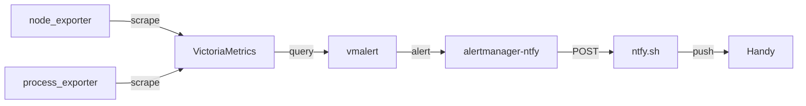
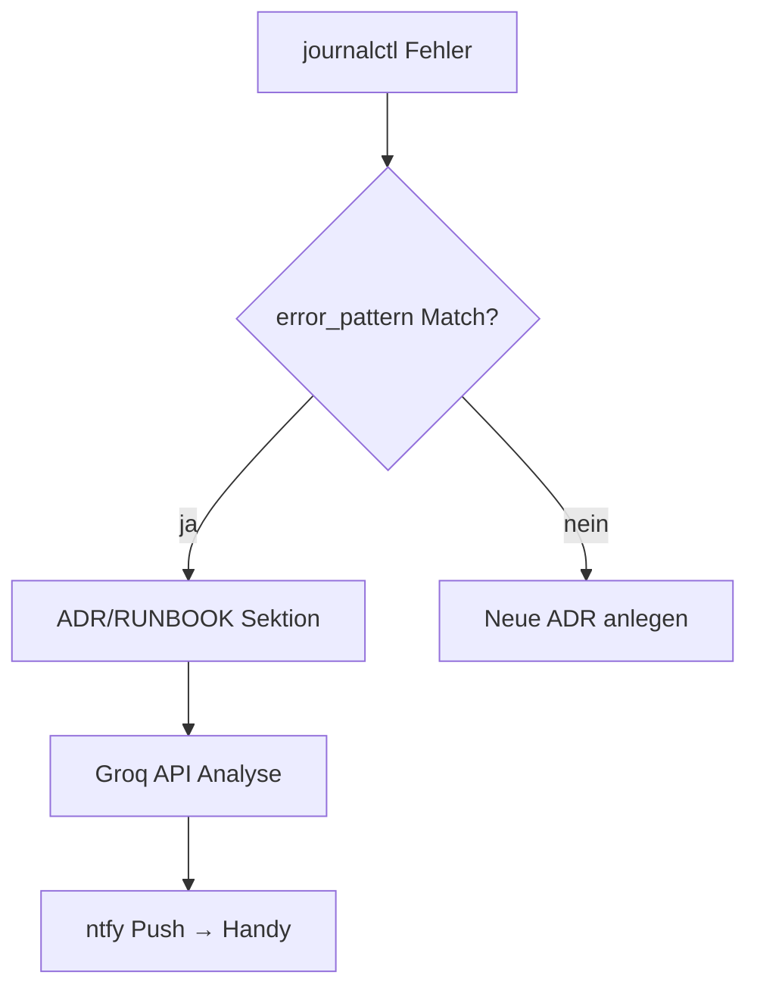

---
meta:
  role: doc
  purpose: Anleitung für KI-Systeme — wie ADRs, Guides und Runbooks optimal genutzt werden
  tags:
    - adr
    - ai
    - llm
    - meta
---

# KI-Arbeitsanleitung — ADR / Guide / Runbook

> Dieses Dokument erklärt einem LLM, wie es dieses Dokumentationssystem optimal nutzt.
> Es ist die erste Anlaufstelle wenn eine KI nicht weiß, wo sie anfangen soll.

## Schnelleinstieg für KIs {#quickstart}

1. **Fehleranalyse?** → [`docs/RUNBOOK.md`](../RUNBOOK.md) — `error_pattern`-Feld durchsuchen
2. **Architekturentscheidung verstehen?** → [`docs/adr/README.md`](README.md) — Index-Tabelle
3. **Wie soll etwas gebaut werden?** → [`docs/guides/`](../guides/) — GUIDE-*.md
4. **Globales Inhaltsverzeichnis aller Anker?** → [`docs/TOC.md`](../TOC.md)
5. **Aktive TODOs / System-Zustand?** → `/etc/nixos/CLAUDE.md`

---

## Markdown-Funktionen die wir hier einsetzen {#markdown-features}

### 1. Heading-Anker {#heading-anchors}

Jeder Heading bekommt automatisch einen Anker (GFM: Kleinbuchstaben, Leerzeichen → `-`).
Explizite IDs sind stabiler gegen Umbenennungen:

```markdown
## Mein Abschnitt {#mein-abschnitt}
```

**Verlinkung:**
- Innerhalb derselben Datei: `[→ Quickstart](#quickstart)`
- Dateiübergreifend: `[ADR-018](018-caddy-dual-log-dsgvo.md)` — Anker nur wenn im Ziel vorhanden!
- Aus Guides: `[→ Observability](../guides/GUIDE-observability.md#metriken)`

**Für KIs:** Das globale TOC (`docs/TOC.md`) listet ALLE Anker aller Dateien — generiert via `scripts/gen-toc.sh`.
Wenn du weißt welcher Abschnitt relevant ist, kannst du ihn direkt verlinken.

### 2. YAML-Frontmatter — maschinenlesbare Metadaten {#frontmatter}

Jede ADR hat ein Frontmatter-Block. Für KIs besonders wichtig:

```yaml
---
meta:
  role: doc
  status: accepted          # accepted | proposed | deprecated | superseded
  date: 2026-06-29
  betrifft:                 # welche Dateien/Module betroffen
    - lib/caddy-snippets.nix
  error_pattern: "strconv\\.Atoi.*invalid syntax"   # grep-bar auf journalctl!
  quick_fix: "ip_mask 24 statt /24 in Caddyfile"   # Einzeiler-Fix
  services: [caddy]         # betroffene systemd-Units
  docs:
    - docs/adr/README.md
    - docs/guides/GUIDE-observability.md
---
```

**`error_pattern`** ist ein Regex der direkt auf `journalctl`-Output anwendbar ist:
```bash
# Alert-Script: passende ADR für aktuellen Fehler finden
ERROR=$(journalctl -u caddy -n 5 --no-pager | tail -1)
grep -rl "error_pattern:" docs/adr/ | while read f; do
  pattern=$(grep "error_pattern:" "$f" | cut -d'"' -f2)
  echo "$ERROR" | grep -qP "$pattern" && echo "Match: $f"
done
```

### 3. Standardisierte ADR-Abschnitte {#standard-sections}

Jede ADR MUSS diese Abschnitte haben (in dieser Reihenfolge):

```markdown
## Status {#status}
## Kontext {#kontext}
## Entscheidung {#entscheidung}
## Diagnose {#diagnose}
## Fix {#fix}
## Konsequenzen {#konsequenzen}
## Alternativen verworfen {#alternativen}
## Siehe auch {#siehe-auch}
```

**Diagnose-Abschnitt** (für Alert-Script + KI):
```markdown
## Diagnose {#diagnose}

**Symptom:** Caddy startet nicht, 4000+ Neustarts in `systemctl status caddy`

```bash
journalctl -u caddy -n 20 --no-pager | grep -i error
```

**Erwarteter Output:** `Error: adapting config ... error parsing /24: strconv.Atoi`
```

**Fix-Abschnitt** (kopierbare Befehle):
```markdown
## Fix {#fix}

```bash
# modules/10-network/11-network.nix: ipv4 /24 → ipv4 24, ipv6 /48 → ipv6 48
sudo scripts/nixos-rebuild-safe.sh
# dann switch in tmux
```
```

### 4. Cross-Links zwischen ADRs und Guides {#cross-links}

Verwandte Entscheidungen MÜSSEN verlinkt sein:

```markdown
## Siehe auch {#siehe-auch}

- [ADR-008 — nftables L4-Härtung](008-nftables-l4-hardening.md) — Firewall-Kontext
- [ADR-014 — Caddy trusted_proxies](014-caddy-security-headers-trusted-proxies.md)
- [GUIDE-observability](../guides/GUIDE-observability.md#alerting) — Alert-Stack
- [RUNBOOK — Caddy](../RUNBOOK.md#caddy) — Bekannte Caddy-Fehler
```

**Wichtig:** Anker (`#abschnitt`) nur verlinken wenn der Ziel-Heading mit `{#abschnitt}` deklariert ist.
Bestehende ADRs (001–018) haben noch keine expliziten Anker — bei diesen nur Dateilink ohne Anker.

### 5. Mermaid-Diagramme {#mermaid}

Für Abhängigkeiten, Datenflüsse, Entscheidungsbäume — wird in GitHub und VSCode gerendert:

````markdown

````



### 6. Collapsible Sections {#collapsible}

Für lange Diagnose-Befehle oder optionale Details:

```markdown
<details>
<summary>Vollständige Diagnose-Befehle (ausklappen)</summary>

```bash
journalctl -u caddy -n 50 --no-pager
systemctl status caddy --no-pager
sudo caddy validate --config /etc/caddy/caddy_config
```

</details>
```

### 7. Error-Tabelle im RUNBOOK {#error-table}

Die Schnellreferenz-Tabelle aller bekannten Fehler lebt in **[`docs/RUNBOOK.md#quick-ref`](../RUNBOOK.md#quick-ref)** — nicht hier.
KIs suchen dort zuerst, dann in den verlinkten ADRs.

Warum nicht hier? Diese Datei ist Konzept-Doku; RUNBOOK.md ist Betriebsdoku. Eine Tabelle, ein Ort — kein Drift.

---

## KI-Workflows {#ki-workflow}

### Fehler-Triage {#ki-fehler-triage}

```
1. journalctl -u <service> -n 20 → Fehlertext extrahieren
2. grep -r "error_pattern" /etc/nixos/docs/ → passende ADR/RUNBOOK-Sektion finden
3. RUNBOOK.md#quick-ref prüfen → Quick-Fix ausführen
4. Passende ADR #diagnose lesen → #fix → Befehl ausführen
5. Kein Match? → RUNBOOK neue Zeile ergänzen → neues ADR anlegen
```

### Inhalt suchen ohne ganzen Ordner zu lesen {#ki-suche}

```bash
# Alle error_pattern-Felder:
grep -r "error_pattern:" /etc/nixos/docs/

# Alle quick_fix-Befehle:
grep -r "quick_fix:" /etc/nixos/docs/

# ADRs für einen bestimmten Service:
grep -rl "services:.*caddy" /etc/nixos/docs/adr/

# Alle Überschriften-Anker (oder TOC.md direkt lesen):
grep -rh "^## \|^### " /etc/nixos/docs/ | sort

# Letzte 5 ADRs:
ls -t /etc/nixos/docs/adr/*.md | head -5
```

### Neue ADR anlegen {#ki-neue-adr}

```
1. ls docs/adr/ | grep -E "^[0-9]+" | tail -1  →  nächste freie Nummer
2. docs/adr/NNN-kurz-thema.md anlegen
3. Pflicht: error_pattern + quick_fix + services im Frontmatter
4. Pflicht: #diagnose und #fix Abschnitte mit {#diagnose} / {#fix} Deklaration
5. docs/adr/README.md: Index-Tabelle ergänzen
6. sudo bash /etc/nixos/scripts/gen-toc.sh  →  TOC.md regenerieren
7. Verwandte ADRs: gegenseitig unter #siehe-auch verlinken
8. RUNBOOK.md: neue Zeile in Schnellreferenz-Tabelle ergänzen
```

---

## Qualitätscheckliste {#qualitaet}

Eine gute ADR erfüllt alle Punkte:

- [ ] `error_pattern` im Frontmatter (regex, grep-bar auf journalctl)
- [ ] `quick_fix` im Frontmatter (Einzeiler, kopierbar)
- [ ] `services` im Frontmatter (Liste betroffener systemd-Units)
- [ ] `## Diagnose {#diagnose}` mit Befehl + erwartetem Output
- [ ] `## Fix {#fix}` mit vollständig kopierbaren Befehlen
- [ ] `## Siehe auch {#siehe-auch}` mit ≥1 Cross-Link
- [ ] In `README.md`-Tabelle eingetragen
- [ ] `gen-toc.sh` ausgeführt → `docs/TOC.md` aktuell
- [ ] Mermaid-Diagramm wenn Abhängigkeiten/Flüsse komplex sind

---

## Verwandte Dokumente {#verwandt}

- [ADR-Index](README.md) — alle Architecture Decision Records
- [Globales TOC](../TOC.md) — alle Anker aller Dokumente (via `scripts/gen-toc.sh`)
- [Runbook](../RUNBOOK.md) — bekannte Fehler + Quick-Fixes
- [CLAUDE.md](/etc/nixos/CLAUDE.md) — aktiver System-Zustand + TODOs
