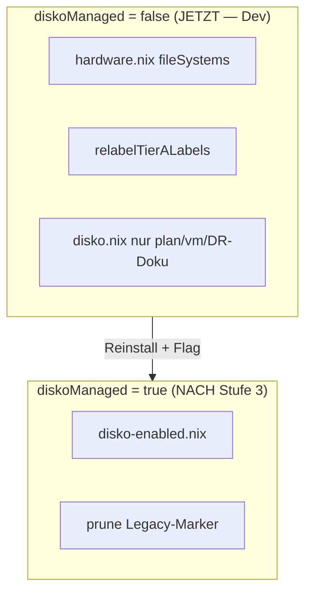

---
meta:
  role: doc
  purpose: disko Lernpfad q958 — Doku-Index, Ökosystem, Template-Diff, Installation
  date: 2026-07-12
  status: current
  docs:
    - docs/adr/3024-disko-tier-a-provisioning.md
    - machines/q958/disko.nix
    - scripts/disko-q958.sh
  tags:
    - disko
    - learning
    - tier-a
---

# disko Lernen (q958) {#guide-disko-learning}

> **Modus jetzt:** Developer-PC — Infrastruktur/Schrank bauen, **kein** `switch`, **kein**
> Schreiben auf Tier-A. Lernen mit `plan` + `vm` nur.

Kurzentscheidungen für q958: [Was wir brauchen](#was-wir-brauchen) ·
[Einfachster Install-Weg](#install-ablauf) · [Lernpfad Stufe 0–3](#lernpfad)

---

## Sicherheitsregel (kritisch) {#sicherheit}

| Befehl | Verhalten | Auf laufendem q958 |
|--------|-----------|-------------------|
| `disko-q958.sh plan` | `--dry-run` + `cat` Store-Skript | **Sicher** |
| `disko-q958.sh vm` | QEMU vmWithDisko | **Sicher** |
| `disko script …` | **FÜHRT AUS** (nicht nur anzeigen!) | **VERBOTEN** |
| `disko-q958.sh install` | destroy+format+mount | **Blockiert** (Live-Guard) |

`plan` nutzt niemals `disko script` — nur den Store-Pfad aus `--dry-run`.

---

## Offizielle disko-Doku (Index) {#doku-index}

| Dokument | URL | Was wir daraus lernen |
|----------|-----|------------------------|
| INDEX | [docs/INDEX.md](https://github.com/nix-community/disko/blob/master/docs/INDEX.md) | Einstieg, Navigation |
| Quickstart | [docs/quickstart.md](https://github.com/nix-community/disko/blob/master/docs/quickstart.md) | ISO → disko → nixos-install (Standardablauf) |
| HowTo | [docs/HowTo.md](https://github.com/nix-community/disko/blob/master/docs/HowTo.md) | Flake-Modul, disko-create/mount Scripts |
| Reference | [docs/reference.md](https://github.com/nix-community/disko/blob/master/docs/reference.md) | CLI-Flags, `--dry-run`, `--root-mountpoint` |
| disko-install | [docs/disko-install.md](https://github.com/nix-community/disko/blob/master/docs/disko-install.md) | USB-Stick, Offline-Installer, EFI vars |
| disko-images | [docs/disko-images.md](https://github.com/nix-community/disko/blob/master/docs/disko-images.md) | Disk-Images für Tests/CI |
| interactive-vm | [docs/interactive-vm.md](https://github.com/nix-community/disko/blob/master/docs/interactive-vm.md) | **vmWithDisko** — sicher ohne echte Platte |
| table-to-gpt | [docs/table-to-gpt.md](https://github.com/nix-community/disko/blob/master/docs/table-to-gpt.md) | GPT-Partlabels (`disk-tierA-NIXBOOT`) |
| upgrade-guide | [docs/upgrade-guide.md](https://github.com/nix-community/disko/blob/master/docs/upgrade-guide.md) | Breaking Changes zwischen Versionen |
| lib/types/ | [lib/types/](https://github.com/nix-community/disko/tree/master/lib/types) | Echte Options-Referenz (`filesystem.nix`: extraArgs, mountOptions) |
| example/ | [example/](https://github.com/nix-community/disko/tree/master/example/) | Alle Layouts — **Test-Configs, nicht 1:1 kopieren** |

**Community (organisatorisch festhalten):**

| Kanal | Link | Wann nutzen |
|-------|------|-------------|
| Matrix **#disko:nixos.org** | [matrix.to/#/#disko:nixos.org](https://matrix.to/#/#disko:nixos.org) | Upstream-Fragen, Breaking Changes, Bug-Reports — Maintainer: Lassulus, Mic92, Enzime u. a. |

---

## Ökosystem — disko ist nie allein {#oekosystem}

### Was ist was?

| Tool | Link | Kurz erklärt |
|------|------|--------------|
| **disko-templates** | [github.com/nix-community/disko-templates](https://github.com/nix-community/disko-templates) | **Startvorlagen** (Nix-Dateien zum Kopieren/Vergleichen). `single-disk-ext4` = GPT + vfat `/boot` + ext4 `/`. Kein Runtime-Paket — nur Lern- und Bootstrap-Material. |
| **disk-deactivate** | [disko/disk-deactivate](https://github.com/nix-community/disko/tree/master/disk-deactivate) | Hilfsskript **in jedem disko destroy-Lauf**: hängt Mounts ab, deaktiviert LUKS/mdraid etc. vor `sgdisk`. Für uns: Recovery-Verständnis, nicht separat installieren. |
| **nixos-anywhere** | [github.com/nix-community/nixos-anywhere](https://github.com/nix-community/nixos-anywhere) | **Remote-Install per SSH**: Ziel bootet per kexec in Installer → disko → NixOS. Docs: [nix-community.github.io/nixos-anywhere](https://nix-community.github.io/nixos-anywhere) |
| **nixpart** | [github.com/NixOS/nixpart](https://github.com/NixOS/nixpart) | Historischer Vorgänger — **für q958 nicht nötig**, nur Konzeptgeschichte. |

### Was macht für q958 Sinn? {#was-wir-brauchen}

| Tool / Konzept | Empfehlung | Aufwand | Begründung |
|----------------|------------|---------|------------|
| **disko** (im Flake) | ✅ Pflicht | erledigt | `disko.nix`, `disko-q958.sh`, `disko-enabled.nix` |
| **disko-templates** | ✅ Lernreferenz | ~30 min Diff | `single-disk-ext4` mit `machines/q958/disko.nix` vergleichen — **nicht** ersetzen |
| **vmWithDisko** | ✅ Stufe 1–2 | ~1 h | `disko-q958.sh vm` — destroy/format/mount ohne SATA |
| **Standard NixOS ISO + Git** | ✅ Stufe 3 (Install) | gering | Einfachster Weg — siehe unten |
| **disko-install** | ⚪ Optional später | mittel | Ein Befehl für disko+nixos-install; wir haben bereits Wrapper |
| **Custom Offline-ISO** | ⚪ Nur bei Airgap | hoch | disko-install.md Closure in Installer packen |
| **nixos-anywhere** | ❌ vorerst nein | **2–4 h** Erstsetup | Sinnvoll für **headless Remote** (Hetzner, Rack ohne Monitor). q958 = physisch vor Ort → USB reicht |
| **nixpart** | ❌ skip | — | disko ist Nachfolger |

**nixos-anywhere Aufwand im Detail:** Flake muss installierbar sein, SSH + kexec auf Ziel,
`--disko-mode`, ggf. `--phases`. Lohnt sich wenn du q958 **nie** physisch anfasst.
Für „USB-Stick rein, fertig“ ist der manuelle Pfad schneller erlernbar.

---

## disko-templates — single-disk-ext4 {#templates}

```bash
# Lernübung in leerem Verzeichnis (nicht in /etc/nixos!):
mkdir -p ~/disko-learn && cd ~/disko-learn
nix flake init --template github:nix-community/disko-templates#single-disk-ext4
diff -u disko-config.nix /etc/nixos/machines/q958/disko.nix
```

Templates sind **kein Dependency** im Flake — nur Referenz. Unser `disko.nix` ist bereits
aus diesem Muster abgeleitet und um q958-Policy erweitert (Labels, by-id, 512M ESP).

### Template-Diff (Kurz) {#template-diff}

| Aspekt | [single-disk-ext4](https://github.com/nix-community/disko-templates/blob/main/single-disk-ext4/disko-config.nix) | q958 `disko.nix` |
|--------|------------------------------------------------------------------------------------------------------------------|------------------|
| Device | `configuration.nix` überschreibt `/dev/sda` | `deviceById` aus `profile.nix` |
| BIOS 1M EF02 | ja | **nein** (systemd-boot, EFI-only) |
| ESP | 1G, `umask=0077` | **512M**, `fmask/dmask` |
| Labels | keine | **NIXBOOT** / **NIXPERSIST** |
| Partition-Namen | `boot`/`ESP`/`root` | **NIXBOOT**/**NIXPERSIST** → `disk-tierA-*` |

Details: [lib/types/filesystem.nix](https://github.com/nix-community/disko/blob/master/lib/types/filesystem.nix) (`extraArgs`, `mountOptions`).

---

## Lernpfad Stufe 0–3 (Developer-PC, ext4-only) {#lernpfad}

### Stufe 0 — Lesen (0 Risiko) {#stufe-0}

- [x] `machines/q958/disko.nix` + `flake.nix` `diskoConfigurations.q958`
- [x] `scripts/disko-q958.sh` + ADR-3024
- [ ] Template-Diff (Befehl oben)
- [ ] `lib/types/filesystem.nix` — `extraArgs`, `mountpoint`, `mountOptions`
- [ ] [table-to-gpt.md](https://github.com/nix-community/disko/blob/master/docs/table-to-gpt.md) — warum `disk-tierA-NIXBOOT`

**Auf Developer-PC:**

```bash
disko-plan    # Skript aus Store lesen, nichts ausführen
```

### Stufe 1 — VM (0 Risiko auf Hardware) {#stufe-1}

```bash
disko-vm      # = disko-q958.sh vm → QEMU vmWithDisko
```

In der VM: Partitionen anlegen, `by-partlabel` beobachten, reboot testen.

### Stufe 2 — Leere SSD oder USB-Stick am Dev-PC (optional) {#stufe-2}

- Zweites Laufwerk einstecken (`lsblk` — **nicht** die Systemplatte!)
- Von Live-ISO oder Installer-Session: `disko-q958.sh install` auf **dieses** Device
- `device`/`deviceById` in `profile.nix` temporär auf Stick zeigen lassen

→ Erst wenn Stufe 0–1 sitzen. **Nicht** auf laufendem q958-Root-Device.

### Stufe 3 — q958 physisch (später, Mensch) {#stufe-3}

Siehe [Installationsablauf](#install-ablauf). Erst wenn Schrank fertig + dry-build grün.

---

## Installationsablauf — was ist am einfachsten? {#install-ablauf}

**Kurzantwort:** Du brauchst **keine eigene ISO** mit disko eingebacken. Der Standardweg ist:

1. **Offizielle NixOS Minimal ISO** auf USB ([nixos.org/download](https://nixos.org/download.html))
2. q958 davon booten (Live-System, RAM only)
3. **Dein Flake/Repo** auf die Maschine bringen
4. `disko-q958.sh install` → Platte partitionieren + nach `/mnt` mounten
5. `nixos-install --flake /etc/nixos#q958 --impure`

### Die drei Wege im Vergleich

| Weg | Wie | q958-tauglich? | Aufwand |
|-----|-----|----------------|---------|
| **A: ISO + Git/USB** | NixOS Live booten, Repo klonen oder zweiten USB-Stick mit `/etc/nixos` | ✅ **Empfohlen** | Gering |
| **B: ISO + curl** | Nur `disko.nix` per curl (Quickstart) | ❌ Nur Demo | Gering, aber **ohne** secrets/profile.local/flake |
| **C: Custom Offline-ISO** | disko + Closure in Installer image ([disko-install.md](https://github.com/nix-community/disko/blob/master/docs/disko-install.md)) | ⚪ Airgap | Hoch |

### Weg A im Detail (unser Pfad)

```text
┌─────────────────┐     ┌──────────────────┐     ┌─────────────────────┐
│ NixOS Minimal   │     │ /etc/nixos       │     │ Tier-A SSD          │
│ ISO auf USB #1  │────▶│ (Git clone oder  │────▶│ disko-q958 install  │
│ (Live, kein     │     │  USB #2 mit Repo)│     │ → /mnt + /mnt/boot  │
│  disko drin)    │     │                  │     │ nixos-install #q958 │
└─────────────────┘     └──────────────────┘     └─────────────────────┘
```

**Repo auf Live-System bringen (eine Option wählen):**

```bash
# Option 1: Git (Netz am Installer)
git clone <dein-remote> /mnt/etc/nixos   # nach disko install unter /mnt

# Option 2: Zweiter USB-Stick mit Repo (offline)
mount /dev/disk/by-label/NIXUSB /mnt/usb
cp -a /mnt/usb/nixos /mnt/etc/nixos

# Option 3: scp von Developer-PC (Netz)
scp -r /etc/nixos root@<installer-ip>:/mnt/etc/nixos
```

**Wichtig:** `profile.local.nix` muss auf dem Installer liegen (Secrets, gitignored).
Ohne sie evaluiert `#q958` nicht.

**Komplettbefehle (Stufe 3, auf Live-ISO — nicht auf laufendem System!):**

```bash
# 1. Repo unter /mnt/etc/nixos (siehe oben)
# 2. Partitionieren + mounten
sudo /mnt/etc/nixos/scripts/disko-q958.sh install

# 3. NixOS installieren
sudo nixos-install --flake /mnt/etc/nixos#q958 --impure --no-root-passwd

# 4. Nach erstem Boot (Mensch): profile.nix
#    diskoManaged = true, generationLimit = 5–7
# 5. verify → prune → dry-build
```

### Brauche ich ein Abbild meines Systems?

**Nein** — du installierst **deklarativ** aus dem Flake, nicht aus einem DD-Image.
Die ISO ist nur der Bootstrap-Installer (Linux + nix). Dein „System-Abbild“ ist
`/etc/nixos` (Git). disko formatiert die Platte; `nixos-install` schreibt den Store.

`disko-install` (Alternative) kombiniert Schritte 2+3 in einem Befehl — für später optional.

---

## Generiertes Skript — Phasen {#skript-analyse}

Beispiel: `docs/guides/examples/disko-q958-destroy-format-mount.sh.example` (aus `disko-plan`).

| Phase | Inhalt |
|-------|--------|
| **destroy** | `disk-deactivate`, `sgdisk --clear` |
| **format** | GPT, `mkfs.vfat -n NIXBOOT`, `mkfs.ext4 -L NIXPERSIST` |
| **mount** | `/mnt` + `/mnt/boot` via `by-partlabel` |

---

## diskoManaged-Switch {#switch}



**disko ersetzt:** Partitionierung, Formatierung, Labels, Install-Mounts.  
**disko ersetzt nicht:** Tier-B/C, MergerFS, Storage-Mover, Restic → später polish.

Modul: `machines/q958/disko-switch.nix` · Manifest: `disko-deprecations.json` → `scope`.

---

## Reinstall-Checkliste (Stufe 3, Mensch) {#reinstall}

1. NixOS ISO booten
2. Repo + `profile.local.nix` nach `/mnt/etc/nixos`
3. `disko-q958.sh install`
4. `nixos-install --flake /mnt/etc/nixos#q958 --impure`
5. `diskoManaged = true`, `generationLimit = 5–7`
6. `disko-verify-active.sh` → `disko-prune-deprecated.sh apply`
7. `nixos-rebuild-safe dry`

---

## Siehe auch {#siehe-auch}

- [GUIDE-storage-tiers.md](GUIDE-storage-tiers.md#disko-tier-a)
- [ADR-3024](../adr/3024-disko-tier-a-provisioning.md) — Entscheidungen, CLI, ESP, Prune
- [disko-templates](https://github.com/nix-community/disko-templates)
- Matrix [#disko:nixos.org](https://matrix.to/#/#disko:nixos.org)