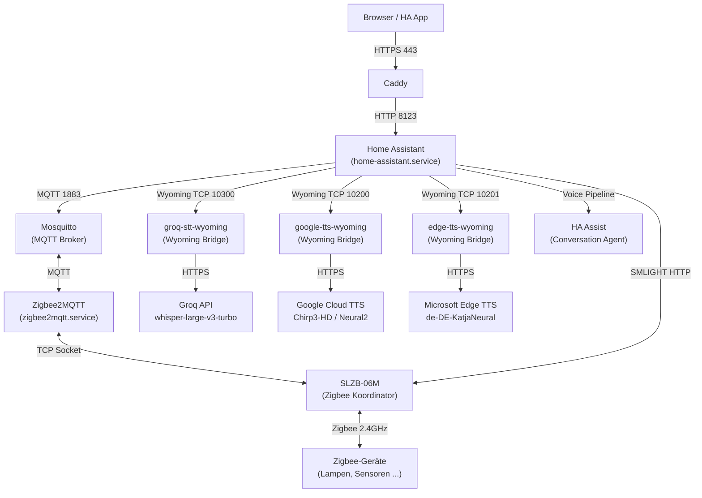

---
meta:
  role: doc
  purpose: GUIDE-home-assistant — Kompletter HA-Stack auf q958 (MQTT, Zigbee, Voice)
  status: current
  docs:
    - docs/adr/7001-loadcredentialencrypted-vs-loadcredential.md
    - docs/adr/7002-ha-storage-provisioning.md
    - docs/adr/7003-groq-stt-wyoming-bridge.md
    - docs/adr/7004-google-tts-wyoming-bridge.md
    - docs/adr/7006-edge-tts-wyoming-bridge.md
  tags:
    - guide
    - home-automation
    - home-assistant
    - mqtt
    - zigbee
    - voice
---

# Guide: Home Assistant Stack {#guide-home-assistant}

> **Rollout:** Stufe 7 · **Module:** `modules/70-home-automation/` · **Architektur:** [ADR-7001](../adr/7001-loadcredentialencrypted-vs-loadcredential.md), [ADR-7002](../adr/7002-ha-storage-provisioning.md), [ADR-7003](../adr/7003-groq-stt-wyoming-bridge.md), [ADR-7004](../adr/7004-google-tts-wyoming-bridge.md), [ADR-7006](../adr/7006-edge-tts-wyoming-bridge.md)

Dieser Guide beschreibt den kompletten Home Assistant Stack auf q958: HA Core, MQTT-Broker, Zigbee-Gateway, und Voice Assistant. Alle Komponenten sind vollständig deklarativ in NixOS konfiguriert — kein imperatives Setup nach `nixos-rebuild switch`.

## Überblick {#ueberblick}



| Dienst | Port | Beschreibung |
|--------|------|--------------|
| `home-assistant` | 8123 | HA Core — UI, Automationen, Integrationen |
| `mosquitto` | 1883 | MQTT Broker — Zigbee-Gerätekommunikation |
| `zigbee2mqtt` | 8080 | Zigbee-Gateway — SLZB-06M → MQTT |
| `groq-stt-wyoming` | 10300 | Wyoming STT Bridge → Groq Whisper API |
| `google-tts-wyoming` | 10200 | Wyoming TTS Bridge → Google Cloud TTS (API Key erforderlich) |
| `edge-tts-wyoming` | 10201 | Wyoming TTS Bridge → Microsoft Edge TTS (kein API Key) |

## Service-Kette beim Boot {#service-kette}

```
q958-secrets-provision          (Klartext-Secrets nach /var/lib/secrets)
  ↓ after/wants
home-assistant-mqtt-provision   (MQTT-Eintrag in .storage/core.config_entries)
  ↓ after/wants
home-assistant-smlight-provision (SMLIGHT-Eintrag in .storage/core.config_entries)
  ↓ before
home-assistant                  (HA startet erst wenn alle Entries gesetzt sind)

groq-stt-wyoming                (unabhängig, startet nach network.target)
edge-tts-wyoming                (unabhängig, startet nach network.target, kein Credential)
google-tts-wyoming              (unabhängig, ConditionPathExists: google_tts_api_key.cred)
mosquitto                       (unabhängig, startet nach secrets-provision)
zigbee2mqtt                     (after mosquitto)
```

Die Reihenfolge der Provision-Services ist kritisch: Ohne sie überschreiben konkurrierende Services einander ([ADR-7002](../adr/7002-ha-storage-provisioning.md)).

## NixOS-Konfiguration {#nix-config}

### Aktivierung in machines/q958/default.nix {#aktivierung}

```nix
my.services = {
  home-assistant = {
    port = 8123;
    zigbeeDevice = "socket://SLZB-06M.local:6638";
    extraComponents = [ "smlight" "cast" ];
    smlightHost = "SLZB-06M.local";
  };
  voice-assistant = {
    enable = true;         # Groq STT (Port 10300)
    tts.enable = true;     # Google TTS (Port 10200, braucht API Key)
    edgeTts.enable = true; # Edge TTS (Port 10201, sofort ohne Key)
  };
  zigbee-stack = {
    mqttPort = 1883;
    zigbeePort = 8080;
    zigbeeDevice = "socket://SLZB-06M.local:6638";
    adapter = "ember";
  };
};
```

### Credentials {#credentials}

Alle Secrets werden via `systemd-creds` versiegelt:

| Credential | Datei | Verwendung |
|-----------|-------|------------|
| `homeassistant_mqtt_password` | `credstore.encrypted/homeassistant_mqtt_password.cred` | HA ↔ MQTT Auth |
| `groq_api_key` | `credstore.encrypted/groq_api_key.cred` | STT Groq API |
| `google_tts_api_key` | `credstore.encrypted/google_tts_api_key.cred` | TTS Google Cloud API |
| — | — | Edge TTS braucht keinen API Key |

Secrets-Kette: `profile.local.nix` → `q958-secrets-provision` → `/var/lib/secrets/` → `systemd-creds encrypt` → `.cred` → `LoadCredentialEncrypted` in Services.

Detailliert: [ADR-7001](../adr/7001-loadcredentialencrypted-vs-loadcredential.md), [ADR-2024 — systemd-creds](../adr/2024-systemd-creds-tpm.md).

## MQTT — Mosquitto + HA {#mqtt}

Mosquitto läuft lokal auf Port 1883. HA und Zigbee2MQTT authentifizieren sich mit separaten Usern.

Die MQTT-Integration wird **nicht** in `configuration.yaml` konfiguriert (HA ≥2026 ignoriert das), sondern über `.storage/core.config_entries` provisioniert:

```python
entry = {
    "domain": "mqtt",
    "entry_id": "q958mqttmosquitto001",   # deterministisch, kein ULID
    "data": {
        "broker": "127.0.0.1",
        "port": 1883,
        "username": "homeassistant",
        "password": "<aus CREDENTIALS_DIRECTORY>",
    },
    ...
}
```

Pattern: [ADR-7002](../adr/7002-ha-storage-provisioning.md) — Filtern nur nach `entry_id`, nicht nach `domain`.

```bash
# MQTT-Verbindung prüfen
sudo grep -o '"password":"[^"]*"' /var/lib/hass/.storage/core.config_entries
# → "password":"#1Baumeister"  (nicht 527-Byte-Blob!)
sudo journalctl -u mosquitto -n 20 --no-pager | grep homeassistant
# → New client connected ... u'homeassistant'
```

## Zigbee — SLZB-06M + Zigbee2MQTT {#zigbee}

Die SLZB-06M ist ein Ethernet-Zigbee-Koordinator (kein USB). Zigbee2MQTT verbindet sich via TCP-Socket:

```nix
zigbeeDevice = "socket://SLZB-06M.local:6638";
```

Der Hostname `SLZB-06M.local` wird via `networking.extraHosts` aufgelöst (kein mDNS nötig). SMLIGHT-Weboberfläche und HA-Integration (Firmware-Updates, Gerätestatus) laufen parallel.

```bash
# Zigbee2MQTT Status
sudo systemctl status zigbee2mqtt --no-pager
sudo journalctl -u zigbee2mqtt -n 20 --no-pager | grep -E "error|connected|paired"

# SLZB-06M erreichbar?
curl -s http://SLZB-06M.local/ha_info | python3 -m json.tool | grep -E "MAC|hostname"
```

## Voice Assistant — STT + TTS {#voice}

### Architektur {#voice-architektur}

```
HA Assist Pipeline
  Mikrofon (HA App / Chromecast mit Mikrofon)
    ↓ Wyoming TCP 10300
  groq-stt-wyoming  →  Groq API (whisper-large-v3-turbo, < 0.5s, Deutsch)
    ↓ Transcript
  HA Assist (Conversation Agent, eingebaut)
    ↓ Response Text
  [wählbar:]
  edge-tts-wyoming  →  Microsoft Edge TTS (de-DE-KatjaNeural, sofort, kein Key)  ← Standard
  google-tts-wyoming  →  Google Cloud TTS (Chirp3-HD / Neural2, nach Key-Setup)  ← optional
    ↓ Wyoming TCP 10200/10201 + AudioChunk*
  Lautsprecher (Chromecast / HA App)
```

Beide TTS-Provider laufen parallel. Im HA-Pipeline-Editor wählst du welcher aktiv ist.

### Setup in HA UI (einmalig) {#voice-setup}

Wyoming wird **nicht** auto-entdeckt — alle Bridges manuell hinzufügen:

**STT hinzufügen:**
1. HA → Einstellungen → Integrationen → Integration hinzufügen → **Wyoming**
2. Host: `127.0.0.1`, Port: `10300`
3. HA erkennt `groq-whisper` als STT-Provider

**Edge TTS hinzufügen** (sofort verfügbar):
1. HA → Einstellungen → Integrationen → Integration hinzufügen → **Wyoming**
2. Host: `127.0.0.1`, Port: `10201`
3. HA erkennt `edge-tts / de-DE-KatjaNeural`

**Google TTS hinzufügen** (erst nach Credential-Setup, wenn Port 10200 aktiv):
1. HA → Einstellungen → Integrationen → Integration hinzufügen → **Wyoming**
2. Host: `127.0.0.1`, Port: `10200`
3. HA erkennt `google-tts` als TTS-Provider

**Voice Pipeline erstellen:**
1. HA → Einstellungen → Sprache → Sprach-Assistent → Pipeline erstellen
2. STT: Groq Whisper (Wyoming)
3. Conversation Agent: Home Assistant (Assist)
4. TTS: Edge TTS (Wyoming) — oder Google TTS nach Key-Setup

### Edge TTS — Stimme ändern {#edge-tts-stimme}

Standardstimme: `de-DE-KatjaNeural`. Andere Stimme via `machines/q958/default.nix`:

```nix
voice-assistant.edgeTts.voice = "de-DE-ConradNeural";
```

Alle verfügbaren deutschen Stimmen:
```bash
nix run nixpkgs#python3Packages.edge-tts -- --list-voices | grep "^de-"
# de-AT-IngridNeural   de-AT-JonasNeural
# de-CH-JanNeural      de-CH-LeniNeural
# de-DE-AmalaNeural    de-DE-ConradNeural
# de-DE-ElkeNeural     de-DE-FlorianMultilingualNeural
# de-DE-GiselaNeural   de-DE-KatjaNeural
# de-DE-KillianNeural  de-DE-LouisaNeural
# de-DE-MajaNeural     de-DE-RalfNeural
# de-DE-SeraphinaMultilingualNeural
```

### Google Cloud TTS — Credential-Setup {#google-tts-key}

Eintragen in `machines/q958/profile.local.nix` (gitignored):

```nix
secrets.devKeys.googleTts = {
  apiKey = "AIza...";                    # GCP Console → APIs → Credentials
  voice  = "de-DE-Chirp3-HD-Aoede";     # oder andere gewählte Stimme
};
```

Nach `nixos-rebuild switch` startet `google-tts-wyoming` automatisch auf Port 10200.

**GCP-Pflichtschritt — Circuit Breaker:**
GCP Console → Abrechnung → Budgets → Budget erstellen → €0 → Aktion: **Abrechnung deaktivieren**.
Schützt gegen API-Key-Leaks. Details: [ADR-7004 — Preismodell](../adr/7004-google-tts-wyoming-bridge.md#preismodell).

> **Free Tier reicht für Jahre:** 1.000.000 Zeichen/Monat (Chirp3-HD) ≈ 10.000 Ansagen.

### Groq API Key verwalten {#groq-key}

```bash
# Key neu versiegeln (interaktiv, kein Terminal-Log):
read -rsp "Groq Key: " K && echo
printf '%s' "$K" > ~/secrets/groq_api_key
chmod 600 ~/secrets/groq_api_key
sudo systemd-creds encrypt --name=groq_api_key ~/secrets/groq_api_key \
  /var/lib/credstore.encrypted/groq_api_key.cred
sudo systemctl restart groq-stt-wyoming
```

Key holen: [console.groq.com](https://console.groq.com) → API Keys → Free Tier (kein Credit Card Billing).

## Neue Integration hinzufügen {#neue-integration}

Muster für jede weitere HA-Integration die nicht auto-discovered werden soll:

1. **Provision-Script** in `home-assistant.nix` (Python, analog zu `hassMqttProvision`)
2. **Deterministischen `entry_id`** wählen: `q958<domain><kurzname>001`
3. **Service-Kette** verlängern: neuer Service `after` dem letzten Provision-Service, `before home-assistant.service`
4. Nicht nach `domain` filtern — nur nach `entry_id` ([ADR-7002](../adr/7002-ha-storage-provisioning.md#eintrag-muster))

```python
# Korrekt:
entries = [e for e in entries if e.get("entry_id") != ENTRY_ID]
# Falsch — entfernt ALLE Einträge der Domain:
entries = [e for e in entries if e.get("entry_id") != ENTRY_ID and e.get("domain") != "mqtt"]
```

## Verifikation {#verifikation}

```bash
# Alle HA-relevanten Services aktiv?
systemctl is-active home-assistant mosquitto zigbee2mqtt groq-stt-wyoming edge-tts-wyoming

# .storage korrekt gesetzt?
sudo python3 -c "
import json
doc = json.load(open('/var/lib/hass/.storage/core.config_entries'))
for e in doc['data']['entries']:
    print(e['domain'], e['entry_id'])
"
# → mqtt   q958mqttmosquitto001
# → smlight q958smlightslzb001

# Wyoming Ports offen?
sudo ss -tlnp | grep -E "10300|10200|10201"
# → LISTEN 0.0.0.0:10300  (STT, immer aktiv)
# → LISTEN 0.0.0.0:10201  (Edge TTS, immer aktiv)
# → LISTEN 0.0.0.0:10200  (Google TTS, nur wenn Credentials gesetzt)

# MQTT Auth OK?
sudo journalctl -u mosquitto --since '5 minutes ago' --no-pager | grep homeassistant
# → kein "Not authorized"
```

## Häufige Probleme {#probleme}

| Symptom | Ursache | Guide / Fix |
|---------|---------|-------------|
| HA: "MQTT not authorized" | `LoadCredential` statt `LoadCredentialEncrypted` | [ADR-7001](../adr/7001-loadcredentialencrypted-vs-loadcredential.md) |
| MQTT-Entry nach Rebuild falsch | Race Condition Provision-Services | [ADR-7002](../adr/7002-ha-storage-provisioning.md) |
| `groq-stt-wyoming` crasht sofort | `AsrModel` fehlt `version=` (wyoming 1.9.0) | [ADR-7003](../adr/7003-groq-stt-wyoming-bridge.md#wyoming-breaking-change) |
| `google-tts-wyoming` bleibt `inactive` | `ConditionPathExists` nicht erfüllt — Credentials fehlen | Credentials in `profile.local.nix`, dann `nixos-rebuild switch` |
| `google-tts-wyoming` crasht sofort | `TtsVoice` fehlt `version=` (wyoming 1.9.0) | [ADR-7004](../adr/7004-google-tts-wyoming-bridge.md#wyoming-breaking-change) |
| `edge-tts-wyoming` crasht | Microsoft-API nicht erreichbar | WAN-Check: `curl -sI https://speech.microsoft.com` |
| Wyoming nicht in HA sichtbar | Manuell hinzufügen (kein Auto-Discovery) | [→ Setup](#voice-setup) |
| Zigbee2MQTT findet SLZB-06M nicht | `networking.extraHosts` prüfen | `ping SLZB-06M.local` |

## Abweichungen vom NixOS-Standard-Ansatz {#abweichungen}

Der Standard-Ansatz in der NixOS-Community unterscheidet sich in einigen Punkten:

| Thema | Gängige Praxis | Unser Ansatz | Grund |
|-------|---------------|--------------|-------|
| **Secrets** | agenix oder sops-nix | systemd-creds + TPM2 ([ADR-2024](../adr/2024-systemd-creds-tpm.md)) | Hardware-Binding ohne externe Key-Datei |
| **HA-Config** | `services.home-assistant.config = { ... }` (Nix → YAML) | Direktes `.storage` Provisioning | Config-Flow-Integrationen ignorieren `configuration.yaml` ab HA 2024 |
| **Wyoming STT** | `services.wyoming.faster-whisper` (lokal) | Groq API Wyoming Bridge | i3-9100 ohne GPU: 8–12s Latenz lokal vs. < 0.5s Cloud |
| **Wyoming TTS** | `services.wyoming.piper` (lokal) | Edge TTS + Google TTS als Cloud-Bridges | Deutsche Piper-Qualität nach Test unzureichend |
| **HACS** | `services.home-assistant.customComponents` | — (kein HACS) | [ADR-032 — OS-native-first](../adr/032-os-native-first.md) |
| **automations.yaml** | `systemd.tmpfiles.rules` zum Anlegen | Über HA UI verwaltet | Automationen sind User-State, nicht Config |

## Siehe auch {#siehe-auch}

- [ADR-7001 — LoadCredentialEncrypted](../adr/7001-loadcredentialencrypted-vs-loadcredential.md) — Credentials korrekt übergeben
- [ADR-7002 — HA .storage Provisioning](../adr/7002-ha-storage-provisioning.md) — Provisioning-Muster und Race Conditions
- [ADR-7003 — Groq STT Wyoming Bridge](../adr/7003-groq-stt-wyoming-bridge.md) — STT-Entscheidung und wyoming 1.9.0 Breaking Change
- [ADR-7004 — Google Cloud TTS Wyoming Bridge](../adr/7004-google-tts-wyoming-bridge.md) — TTS-Entscheidung, Preismodell, Circuit Breaker
- [ADR-7006 — Microsoft Edge TTS Wyoming Bridge](../adr/7006-edge-tts-wyoming-bridge.md) — TTS ohne API Key
- [ADR-2024 — systemd-creds + TPM2](../adr/2024-systemd-creds-tpm.md) — Credentials-Architektur
- [NixOS Wiki: Home Assistant](https://wiki.nixos.org/wiki/Home_Assistant) — kanonische Referenz für NixOS-Standardansatz
