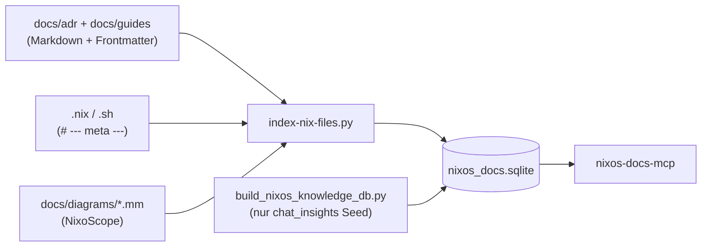

---
meta:
  role: guide
  purpose: Architektur und Bedienung der serverlosen nixos_docs.sqlite (FTS5)
  status: current
  date: 2026-07-12
  tags:
    - sqlite
    - mcp
    - fts5
    - adr
    - indexer
  docs:
    - docs/guides/ANTIPATTERNS.md#lokale-ki
    - modules/80-agents/mcp.nix
---

# GUIDE — Knowledge Database (SQLite)

> **Eine** serverlose SQLite-Datei: `/var/lib/nixos-docs-mcp/nixos_docs.sqlite`  
> Kein DuckDB, kein Server-Prozess, **keine lokale KI** auf q958 — nur FTS5.

## Architektur {#architektur}



### Tabellen

| Tabelle | Inhalt | Suche |
|---------|--------|-------|
| `source_files` + `_fts` | Volltext aller Dateien | `search_docs`, `search_nix`, `search_all` |
| `doc_meta` / `doc_tags` | Frontmatter (`status`, `purpose`, `error_pattern`, …) | `get_meta`, `triage_error` |
| `doc_chunks` + `_fts` | Markdown-Abschnitte (`##`/`###`) | `search_chunks` |
| `doc_links` | `meta.docs`, `betrifft`, `siehe_auch`, `module_import` | `list_doc_links` |
| `chat_insights` + `_fts` | Destilliertes Chat-Wissen (Seed-JSON) | `fts_search` |

**Keine Embeddings** — Vektor-Suche und Ollama sind auf q958 ein [Antipattern](ANTIPATTERNS.md#lokale-ki).

## Pipeline {#pipeline}

1. **Indexer** (`nixos-docs-indexer.service`, nach Boot/Rebuild):
   ```bash
   sudo python3 /etc/nixos/scripts/index-nix-files.py
   ```
   - Parst verschachteltes `meta:`-Frontmatter
   - Chunked `.md` nach `##`/`###` (mit `{#anker}`)
   - Extrahiert Links aus Frontmatter + `## Siehe auch`
   - Importiert `module_import`-Kanten aus `docs/diagrams/*.mm`

2. **Chat-Insights Seed** (manuell, bei Bedarf):
   ```bash
   python3 /etc/nixos/tools/build_nixos_knowledge_db.py \
     --target /var/lib/nixos-docs-mcp/nixos_docs.sqlite
   ```

## MCP-Verdrahtung {#mcp-verdrahtung}

Declarativ in `modules/80-agents/mcp.nix`:

| Konsument | Server-Name | Binary |
|-----------|-------------|--------|
| Claude Code | `nixos-docs` | `~/.local/bin/nixos-docs-mcp` |
| Grok | `nixos-docs` | `~/.grok/config.toml` + `/etc/nixos/.mcp.json` |
| Hermes | `nixos-docs` | Store-Wrapper |

Diagnose: `bash /etc/nixos/scripts/mcp-status.sh`

## MCP-Tools {#mcp-tools}

| Frage | Tool |
|-------|------|
| ADR/Guide-Abschnitt per Keyword | `search_chunks` |
| Frontmatter + Tags eines Pfads | `get_meta` |
| journalctl → ADR quick_fix | `triage_error` |
| Ganze Markdown-Datei | `search_docs` (Filter: `status`, `role`, `tag`) |
| Nix-Modul / Service-Code | `search_nix` |
| Chat-Erkenntnis | `fts_search` |
| Wer verlinkt wen? (inkl. Modul-Graph) | `list_doc_links` |

### KI-Workflow (vor `modules/`/`lib/`-Änderung)

1. `search_chunks` — bestehende ADR-Abschnitte
2. `list_doc_links` — `betrifft` + `module_import`
3. `search_nix` — bestehende Implementierung
4. Erst danach Dateien im Repo öffnen

## Siehe auch {#siehe-auch}

- [ANTIPATTERNS — Lokale KI](ANTIPATTERNS.md#lokale-ki)
- [FILE-META.md](../FILE-META.md) — Frontmatter-Schema
- [CLAUDE-GUIDE.md](../adr/CLAUDE-GUIDE.md) — Markdown-Konventionen für KIs
- [ADR-Index](../adr/README.md)