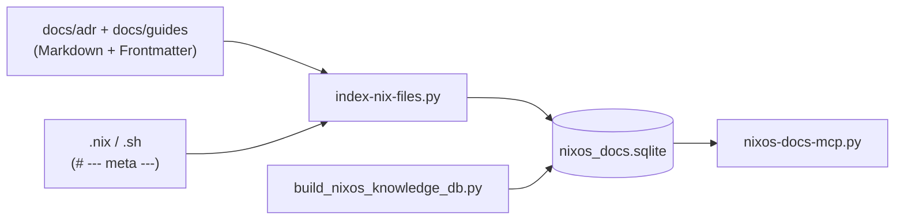

---
meta:
  role: guide
  purpose: Architektur und Bedienung der serverlosen nixos_docs.sqlite (FTS5 + sqlite-vec)
  status: current
  date: 2026-07-10
  tags:
    - sqlite
    - mcp
    - fts5
    - vector
    - adr
    - indexer
---

# GUIDE — Knowledge Database (SQLite)

> **Eine** serverlose SQLite-Datei: `/var/lib/nixos-docs-mcp/nixos_docs.sqlite`  
> Kein DuckDB, kein Server-Prozess — nur Indexer/Embedder als systemd oneshots.

## Architektur {#architektur}



### Tabellen

| Tabelle | Inhalt | Suche |
|---------|--------|-------|
| `source_files` + `_fts` | Volltext aller Dateien | `search_docs`, `search_nix`, `search_all` |
| `doc_meta` / `doc_tags` | Frontmatter (`status`, `purpose`, `error_pattern`, …) | Filter in `search_docs` |
| `doc_chunks` + `_fts` | Markdown-Abschnitte (`##`/`###`) | `search_chunks`, `hybrid_search_docs` |
| `doc_links` | `meta.docs`, `betrifft`, `## Siehe auch` | `list_doc_links` |
| `doc_chunk_embeddings` | Vektoren pro Chunk (384-dim) | `vec_search_docs`, `hybrid_search_docs` |
| `chat_insights` + `_fts` | Destilliertes Chat-Wissen | `fts_search`, `hybrid_search` |
| `insight_embeddings` | Vektoren pro Insight | `vec_search`, `hybrid_search` |

## Markdown → DB Pipeline {#pipeline}

1. **Indexer** (`nixos-docs-indexer.service`, nach Boot/Rebuild):
   ```bash
   sudo python3 /etc/nixos/scripts/index-nix-files.py
   ```
   - Parst verschachteltes `meta:`-Frontmatter
   - Chunked `.md` nach `##`/`###` (mit `{#anker}`)
   - Extrahiert Links aus Frontmatter + `## Siehe auch`

2. **Embedder** (`nixos-docs-embedder.service`, wöchentlich + 5 min nach Boot):
   ```bash
   sudo OLLAMA_HOST=http://127.0.0.1:11434 \
     python3 /etc/nixos/tools/build_nixos_knowledge_db.py \
     --target /var/lib/nixos-docs-mcp/nixos_docs.sqlite --skip-seed
   ```
   - Inkrementell: nur geänderte Chunks neu embedden (`content_hash`)
   - Modell: `nomic-embed-text` via Ollama

3. **Seed import** (bei Bedarf, überschreibt Chat-Insights aus Seed):
   ```bash
   python3 /etc/nixos/tools/build_nixos_knowledge_db.py \
     --target /var/lib/nixos-docs-mcp/nixos_docs.sqlite
   ```

## MCP-Tools — wann welches? {#mcp-tools}

| Frage | Tool |
|-------|------|
| ADR/Guide-Abschnitt per Keyword | `search_chunks` |
| Semantisch ähnliche Doku | `hybrid_search_docs` (+ Ollama-Embedding) |
| Ganze Markdown-Datei | `search_docs` (Filter: `status`, `role`, `tag`) |
| Nix-Modul / Service-Code | `search_nix` |
| Chat-Erkenntnis | `hybrid_search` |
| Wer verlinkt wen? | `list_doc_links` |

**Claude Code / Hermes:** `nixos-docs-mcp.py` auf `/var/lib/nixos-docs-mcp/nixos_docs.sqlite`

## Tridirektionale Links {#links}

Siehe [FILE-META.md](../FILE-META.md#tridirektionale-verlinkung):

- `.nix` → `meta.docs: [docs/adr/…, docs/guides/…]`
- ADR → `betrifft:` + `## Siehe auch`
- Guide → `## Siehe auch` zurück

Der Indexer schreibt alle Kanten nach `doc_links`.

## Siehe auch {#siehe-auch}

- [FILE-META.md](../FILE-META.md) — Frontmatter-Schema
- [CLAUDE-GUIDE.md](../adr/CLAUDE-GUIDE.md) — Markdown-Konventionen für KIs
- [ADR-Index](../adr/README.md)