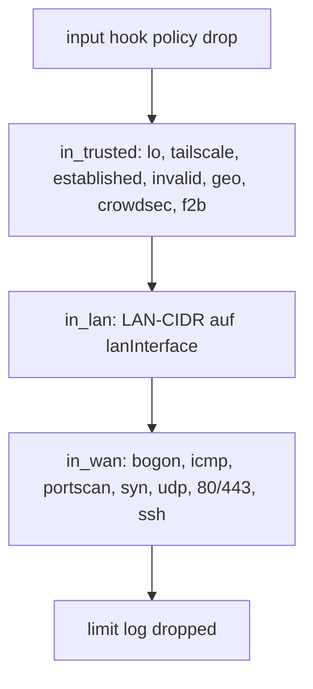

---
meta:
  role: doc
  purpose: Guide — nftables L4-Härtung für Homelab q958
  docs:
    - docs/adr/008-nftables-l4-hardening.md
    - docs/adr/011-unified-port-uid-schema.md
  tags:
    - guide
    - nftables
---

# Guide: nftables L4-Härtung {#guide-nftables}

> **Rollout:** Stufe 8+ · **Modul:** `modules/15-firewall.nix` · **Generator:** `lib/nftables-rules.nix`  
> **Architektur-Entscheidung:** [ADR-008 — nftables L4-Härtung](../adr/008-nftables-l4-hardening.md)

## Rollen-Trennung {#rollen-trennung}

| Schicht | Aufgabe | Modul |
|---------|---------|-------|
| L4 Filter | Geo, Rate, SYN/UDP, skuid, Fail2ban | `15-firewall.nix` |
| DNS Adblock | StevenBlack, Easyprivacy | Blocky (`10-network.nix`) |
| L7 Auth | SSO, Streaming | Caddy |

**Kein Geo in Caddy** — eine Wahrheit in nftables ([ADR-008 — Entscheidung](../adr/008-nftables-l4-hardening.md#entscheidung)).

## Chain-Ablauf {#chain-ablauf}



## Optionen (`my.security.firewall`) {#optionen}

| Option | Default q958 | Beschreibung |
|--------|--------------|--------------|
| `checkRuleset` | `true` | Syntax-Check vor Aktivierung |
| `lanInterface` | `eno1` | LAN nur von physischem Interface |
| `wanInterface` | `""` | Single-NIC — kein WAN-Iface |
| `tailscaleNotrack` | `true` | raw NOTRACK für `tailscale0` |
| `skuidSegmentation.enable` | Stufe 8 | UID-basierte Micro-Segmentation |

## Fail2ban ↔ nftables {#fail2ban}

Bei aktivem Firewall-Modul:

- Set: `inet filter f2b_blocked_ipv4` (timeout 1h)
- Banaction: `nftables-f2b-set` (in `20-security.nix`)
- Regel: `ip saddr @f2b_blocked_ipv4 drop` in `in_trusted` (vor HTTP)

CrowdSec-Bouncer schreibt ebenfalls in nftables-Sets — beide Consumer laufen parallel (Stufe 8+).

## skuid (UID-Registry) {#skuid}

| UID | Dienst | Regel |
|-----|--------|-------|
| 5006 | Prowlarr | output: nur VPN/LAN/Tailscale |
| 5007 | SABnzbd | output: nur VPN/LAN/Tailscale |
| 5003 | Sonarr | input: kein WAN, nur LAN+Tailscale |
| 5004 | Radarr | input: kein WAN, nur LAN+Tailscale |
| 5005 | Readarr | input: kein WAN, nur LAN+Tailscale |

Registry: `lib/uid-registry.nix` — UIDs folgen dem [ADR-011 Port=UID=Präfix-Schema](../adr/011-unified-port-uid-schema.md#entscheidung).

## Verifikation nach Rebuild {#verifikation}

```bash
sudo nft list ruleset | less
sudo nft list set inet filter f2b_blocked_ipv4
systemctl status nftables fail2ban
```

## Alerting (optional) {#alerting}

`modules/05-alerting.nix` — ntfy/Matrix-Webhook bei VPN-NetNS- oder Restic-Fehler.  
URLs in `profile.local.nix` unter `alerting.ntfyTopic` / `alerting.webhookUrl`.

## Siehe auch {#siehe-auch}

- [ADR-008 — nftables L4-Härtung](../adr/008-nftables-l4-hardening.md) — vollständige Architektur-Entscheidung mit Diagnose + Fix
- [ADR-011 — Port=UID=Präfix-Schema](../adr/011-unified-port-uid-schema.md) — Basis für `skuid`-Regeln
- [GUIDE-security-secrets.md](GUIDE-security-secrets.md) — Fail2ban-Kontext, SSH-Härtung, Kernel-Härtung
- [RUNBOOK.md](../RUNBOOK.md) — Quick-Fix bei Firewall-Problemen
