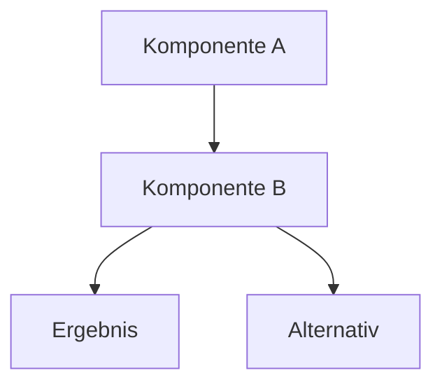

---
meta:
  role: doc
  purpose: "Vorlage für neue Guides — kopieren, Platzhalter füllen, als GUIDE-thema.md speichern"
  status: template
  docs:
    - docs/adr/README.md
    - docs/FILE-META.md
  tags:
    - template
    - guide
---

<!--
  ANLEITUNG — Diese Kommentare im fertigen Guide entfernen!

  DATEINAME:  GUIDE-kurzes-thema.md   (immer GUIDE- Präfix)
  SPEICHERN:  docs/guides/GUIDE-thema.md
  NACHHER:    sudo bash /etc/nixos/scripts/gen-toc.sh   (TOC aktualisieren)

  ANKER-SYNTAX (immer explizit, nie auf Auto-Anker verlassen!):
    ## Mein Abschnitt {#mein-abschnitt}
    Unterabschnitt:  ### Details {#mein-abschnitt-details}
    Erstes H1:       # Guide: Titel {#guide-thema}

  CROSS-LINK-SYNTAX:
    Andere ADR:        [ADR-NNN — Titel](../adr/NNN-datei.md)
    ADR-Abschnitt:     [ADR-NNN Entscheidung](../adr/NNN-datei.md#entscheidung)
    Anderer Guide:     [GUIDE-foo.md](GUIDE-foo.md)
    Guide-Abschnitt:   [GUIDE-foo.md#abschnitt](GUIDE-foo.md#abschnitt)
    Runbook:           [RUNBOOK.md](../RUNBOOK.md#abschnitt)
    Checklisten:       [CHECKLISTS.md#abschnitt](../CHECKLISTS.md#abschnitt)
    ANTIPATTERNS:      [ANTIPATTERNS.md#slug](ANTIPATTERNS.md#slug)

  TRIDIREKTIONALE VERLINKUNG:
    1. Dieser Guide → ADR (## Siehe auch)
    2. ADR → dieser Guide (## Siehe auch dort eintragen!)
    3. .nix Datei → dieser Guide (meta.docs: [docs/guides/GUIDE-thema.md])
    Details: docs/FILE-META.md#tridirektionale-verlinkung

  MARKDOWN-FEATURES IN DIESEM PROJEKT:
    ✓ Frontmatter (---meta:---) — immer
    ✓ {#anker} auf alle ## und ### — immer
    ✓ Tabellen
    ✓ Fenced code blocks mit Sprachtag (bash, nix, yaml, mermaid)
    ✓ Mermaid-Diagramme (flowchart TD / LR, sequenceDiagram)
    ✓ <details><summary> — für lange Diagnosen/Alternativen
    ✓ Blockquote > für Kurzinfo/Warnung
    ✓ Fett/Kursiv für Key-Begriffe
    ✗ Kein HTML außer <details>/<summary>
    ✗ Keine verschachtelten Listen > 2 Ebenen
-->

# Guide: Titel {#guide-thema}

> **Rollout:** Stufe N · **Modul:** `modules/XX-layer/foo.nix` · **Architektur:** [ADR-NNN](../adr/NNN-datei.md)

Kurze Einleitung: Was erklärt dieser Guide? Für wen ist er relevant? (2–3 Sätze, kein Fließtext-Roman.)

## Überblick {#ueberblick}

<!--
  Optional: Mermaid-Diagramm für Zusammenhänge.
  flowchart TD = top-down, LR = left-right.
  Nur wenn das Diagramm wirklich Mehrwert bringt gegenüber Text.
-->



| Begriff | Bedeutung |
|---------|-----------|
| Foo | Kurzerklärung |
| Bar | Kurzerklärung |

## Abschnitt Eins {#abschnitt-eins}

Fließtext mit **wichtigen Begriffen** fett und `Code` inline.

```nix
# Beispiel NixOS-Config
services.foo = {
  enable = true;
  port = config.my.ports.foo;
};
```

### Unterabschnitt {#abschnitt-eins-details}

Für längere Abschnitte mit Unterstruktur. Anker immer explizit.

```bash
# Beispiel Shell-Befehl
systemctl status foo.service
journalctl -u foo --since '1 hour ago' --no-pager
```

## Abschnitt Zwei {#abschnitt-zwei}

<!--
  Tabellen: 3+ Spalten wenn sinnvoll, nicht erzwingen.
  Ausrichtung: | links | zentriert | rechts |
                |:------|:---------:|-------:|
-->

| Option | Default | Beschreibung |
|--------|---------|--------------|
| `my.services.foo.enable` | `false` | Aktiviert den Dienst |
| `my.ports.foo` | `5001` | Listening-Port |

<details>
<summary>Details / erweiterte Konfiguration (ausklappen)</summary>

Dieser Block erscheint erst nach Aufklappen. Gut für:
- Vollständige Diagnose-Befehle
- Seltene Edge Cases
- Migrations-Schritte

```bash
# Erweiterte Diagnose
nft list ruleset | grep foo
```

</details>

## Verifikation {#verifikation}

```bash
# Schritt 1: Dienst läuft
systemctl status foo.service --no-pager

# Schritt 2: Ports korrekt
ss -tlnp | grep :5001

# Schritt 3: Health-Check
curl -s http://127.0.0.1:5001/health
```

> **Achtung:** Vor jedem `nixos-rebuild switch` zuerst Dry-Build:
> ```bash
> sudo bash /etc/nixos/scripts/nixos-rebuild-safe.sh
> ```

## Häufige Probleme {#probleme}

<!--
  Optional: nur wenn es wirklich wiederkehrende Probleme gibt.
  Für Runbook-Würdige Probleme → RUNBOOK.md, hier nur verlinken.
-->

| Symptom | Ursache | Fix |
|---------|---------|-----|
| `foo.service: failed` | Fehlende Secrets | `ls /var/lib/secrets/foo.env` |

Ausführlichere Fixes: [RUNBOOK.md — Foo](../RUNBOOK.md#foo)

## Siehe auch {#siehe-auch}

<!--
  PFLICHT: Mindestens 1 ADR-Link.
  Format: [ADR-NNN — Titel](../adr/NNN-datei.md) — ein Satz warum relevant
  Bidirektional: diesen Guide auch in ## Siehe auch des verlinkten ADR eintragen!
-->

- [ADR-NNN — Entscheidungstitel](../adr/NNN-datei.md) — warum diese Architekturentscheidung hier relevant ist
- [GUIDE-verwandte.md](GUIDE-verwandte.md) — ergänzender Guide für verwandtes Thema
- [RUNBOOK.md](../RUNBOOK.md) — Quick-Fixes bei Betriebsproblemen
- [ANTIPATTERNS.md](ANTIPATTERNS.md) — was man in diesem Bereich vermeiden soll
